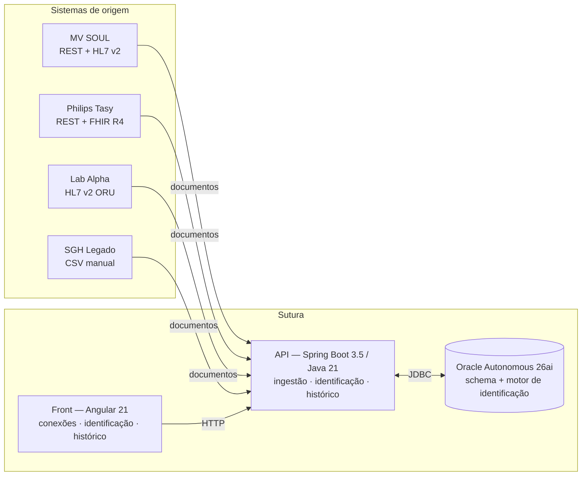
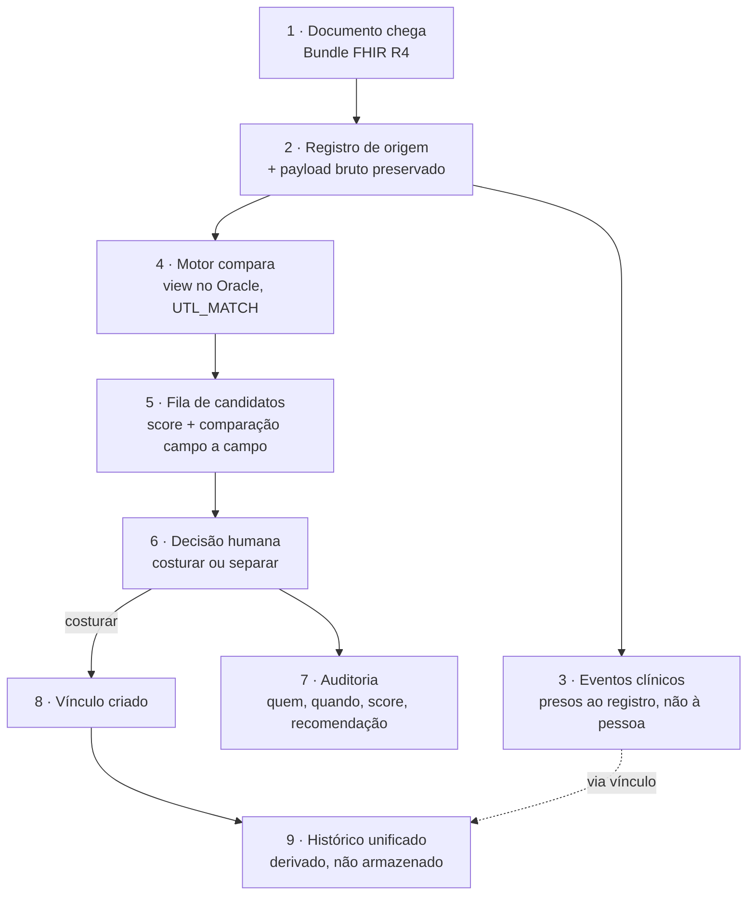
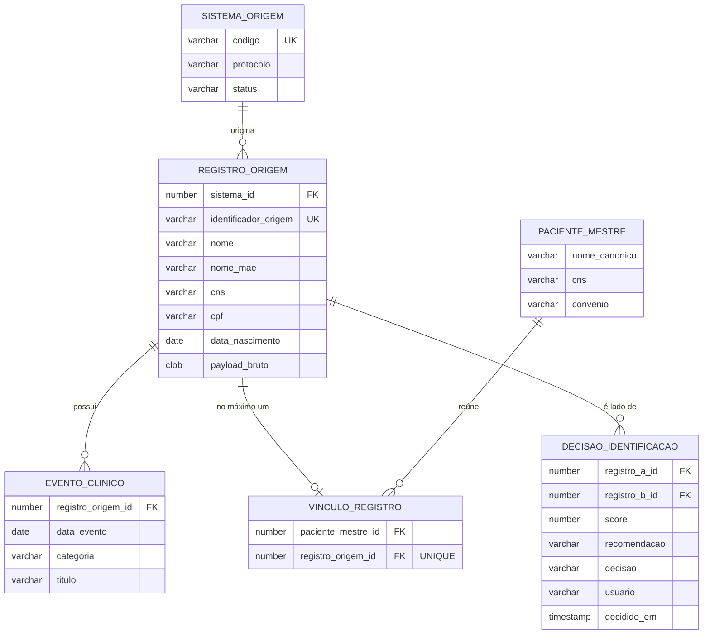
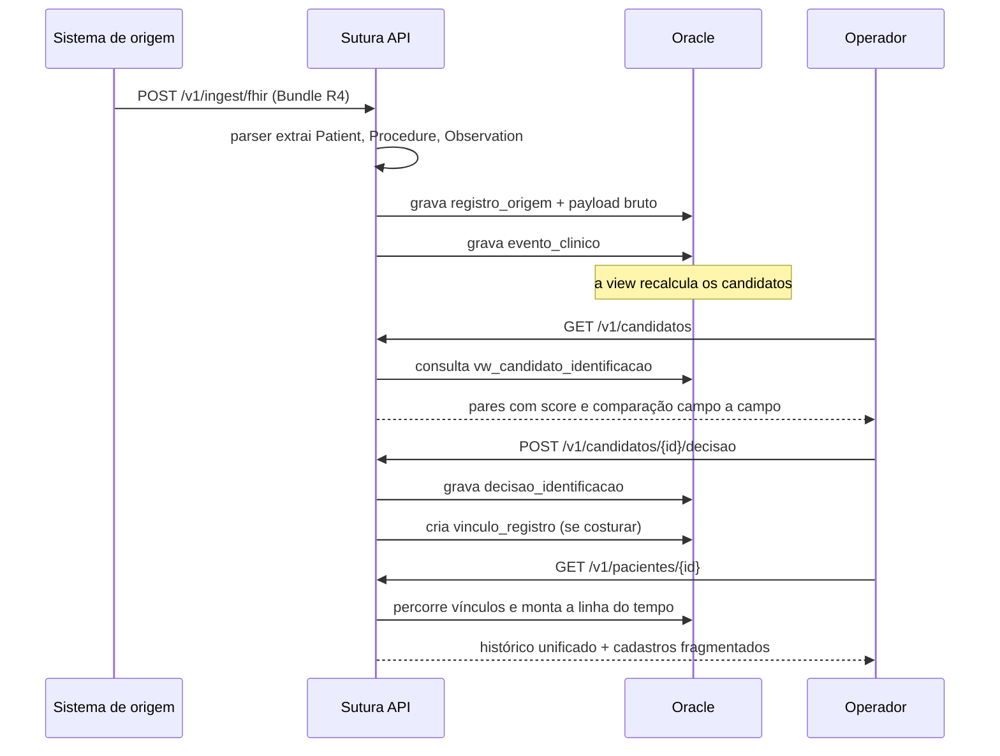

# Arquitetura da Sutura

Documento de 04/09/2026, escrito a partir dos pedidos do mentor da Oracle na mentoria de
03/09: ciclo de vida do dado, como a API se conecta aos sistemas, adaptação a mudanças de
API, e arquitetura do sistema e do dado.

> **Este documento descreve o que existe.** Onde algo é desenho e não implementação, está
> marcado como tal. A seção final lista o que não existe, de propósito.

---

## 1. As três camadas

**O motor de identificação não está na API — está no banco.** É uma view, não código Java.
A API orquestra e traduz; quem compara pacientes é o Oracle, com `UTL_MATCH`. Essa escolha
está justificada na seção 6.

---

## 2. Ciclo de vida do dado

O princípio que organiza tudo: **o dado que chega de um sistema de origem nunca é
sobrescrito nem apagado.** A identidade unificada é uma camada por cima, ligada por
vínculos explícitos.

### O que acontece em cada etapa

**1 e 2 — Chegada e preservação.** O documento original é gravado inteiro em
`registro_origem.payload_bruto`. Isso não é redundância: é o que permite reprocessar quando
a interpretação estiver errada, **sem pedir o dado de novo ao ERP**. É também o que sustenta
auditoria — dá para provar o que o sistema de origem realmente enviou.

**3 — Eventos.** Um evento clínico pertence ao **registro de origem**, nunca diretamente à
pessoa. Consequência: costurar e descosturar reorganizam a linha do tempo sem tocar em
nenhum evento. Nada é copiado, nada é movido.

**4 e 5 — Comparação.** Uma view calcula, para cada par de registros de sistemas diferentes,
um score de 0 a 100 e uma recomendação. Roda no banco, sobre os dados onde eles estão.

**6 e 7 — Decisão.** O sistema **recomenda**; uma pessoa decide. Toda decisão é gravada com
usuário, momento, o score e a recomendação que a máquina havia dado — **inclusive as
decisões de separar**. Para dado de saúde isso não é recurso, é condição de entrada.

**8 e 9 — Identidade.** Costurar cria uma linha em `vinculo_registro`. O histórico
unificado **não é uma tabela** — é o resultado de percorrer os vínculos. Por isso ele muda
no instante em que uma costura acontece.

### O que isso garante

| Propriedade | Como |
|---|---|
| Dado de origem é imutável | Nunca há `UPDATE` em `registro_origem` vindo de decisão de identidade |
| Costura é reversível | Desfazer é apagar um vínculo. Nenhum evento se perde |
| Nada se decide sozinho | Não há caminho de código que crie vínculo sem decisão registrada |
| Um registro, um paciente | `UNIQUE (registro_origem_id)` em `vinculo_registro` — o banco recusa, não o programa |

---

## 3. Modelo de dados

**As duas invariantes que o banco impõe, e não o código:**

- `UNIQUE (registro_origem_id)` em `vinculo_registro` — um registro nunca pertence a dois
  pacientes. É a barreira estrutural contra o prontuário falso.
- `UNIQUE (registro_a_id, registro_b_id)` em `decisao_identificacao` — um par é decidido
  uma vez.

**O schema é versionado.** Oito migrations Flyway, aplicadas em ordem, reproduzíveis do
zero em qualquer instância. O banco é código, não algo que alguém montou na mão.

---

## 4. Como a API se conecta aos sistemas

### O que existe hoje

**A superfície da API, hoje:**

| Método | Rota | Papel |
|---|---|---|
| `GET` | `/v1/conexoes` | Sistemas conectados e volume ingerido |
| `POST` | `/v1/ingest/fhir` | Recebe Bundle FHIR R4 — JSON ou upload |
| `POST` | `/v1/ingest/exemplo` | Ingere o lote de demonstração do classpath |
| `GET` | `/v1/candidatos` | Fila de identificação |
| `POST` | `/v1/candidatos/{id}/decisao` | Registra a decisão humana |
| `GET` | `/v1/pacientes/{id}` | Histórico unificado + visão fragmentada |

### O modelo de conexão

A Sutura **recebe**; não vai buscar. Hoje a ingestão é por `POST`, o que significa que o
lado do ERP — ou um agente instalado no cliente — empurra o documento.

**Desenho, não implementado:** os três modos de conexão que um cliente real exigiria.

| Modo | Quando se usa | Situação |
|---|---|---|
| **Push do ERP** | ERP moderno com webhook ou barramento | ✅ é o que existe |
| **Pull agendado** | ERP com API REST/FHIR de consulta | desenho |
| **Agente no cliente** | ERP legado sem API, banco acessível só na rede interna | desenho |

O terceiro é o caso brasileiro mais comum e o mais trabalhoso. Um agente dentro da rede do
hospital lê o que consegue — banco, arquivo, HL7 em pasta — normaliza e empurra para a
Sutura. É também o que resolve a objeção de segurança: **o dado sai por uma conexão que o
hospital controla**, não por uma porta aberta para fora.

---

## 5. Adaptação a mudanças de API

Esta é a pergunta mais difícil das quatro, porque integração com ERP de terceiro quebra —
não é hipótese, é rotina.

### O que já protege

**O payload bruto.** Quando um sistema de origem muda um campo e o parser passa a
interpretar errado, o documento original continua gravado. Dá para **corrigir o parser e
reprocessar o histórico**, sem depender de o ERP reenviar nada. É a diferença entre "perdemos
três meses de dado" e "rodamos de novo".

**O isolamento do parser.** A tradução do documento externo para o modelo interno acontece
num ponto só — hoje `FhirBundleParser`. O resto do sistema conhece `registro_origem`, não
conhece FHIR. Mudança de formato externo fica contida numa classe.

**A tolerância deliberada no parser.** CNS e CPF são identificados por o campo `system` do
identifier **conter** "cns" ou "cpf", não por URL exata. Cada ERP brasileiro usa uma URL
diferente, e travar numa quebraria na primeira integração real.

**Migrations versionadas.** Mudança de schema é arquivo numerado, aplicado em ordem,
reproduzível. Não existe "alguém alterou a tabela em produção".

### O que falta, e é honesto reconhecer

| Lacuna | Consequência |
|---|---|
| **Sem testes de contrato** | Uma mudança no formato de origem só aparece quando quebra em produção |
| **Sem versionamento de adaptador** | Não dá para rodar duas versões do parser em paralelo durante uma transição |
| **Sem quarentena de ingestão** | Documento que o parser não entende hoje é ignorado silenciosamente; deveria ir para uma fila de revisão |
| **API própria sem política de versão** | O prefixo `/v1` existe, mas não há regra escrita do que é mudança compatível |

**O caminho, quando houver cliente real:** para cada ERP integrado, guardar um conjunto de
documentos reais anonimizados como *fixture* e rodar o parser contra eles a cada build. Se
o formato mudar, a build quebra antes do cliente perceber. É barato e resolve a maior parte
do problema.

---

## 6. Decisões de arquitetura, e por quê

### O motor de identificação roda no banco

`UTL_MATCH.JARO_WINKLER_SIMILARITY` é função nativa do Oracle. Trazer centenas de milhares
de registros para a JVM só para comparar texto seria desperdiçar exatamente o que o banco
faz bem.

**Consequência medida:** 20 mil registros, 608 mil pares avaliados, 21 segundos numa
instância de 1 OCPU. Detalhes em [medicao-escala.md](medicao-escala.md).

### O evento pertence ao registro, não à pessoa

Alternativa descartada: gravar `paciente_mestre_id` no evento. Ela obrigaria a atualizar
todos os eventos a cada costura, e a reverter tudo ao descosturar.

Do jeito que está, **costurar é inserir uma linha**. A linha do tempo da paciente da
demonstração salta de 4 para 12 eventos sem que nenhum evento seja tocado.

### A decisão de identidade é humana

O sistema recomenda; a pessoa decide. Duas razões: o custo do erro é assimétrico — unir dois
pacientes por engano é risco clínico, deixar separado é só trabalho — e a rastreabilidade
exigida para dado sensível pressupõe um responsável.

### O blocking usa UNION, não OR

Descoberto medindo. Com `OR` de quatro colunas, o otimizador não escolhe caminho por índice:
ordena os dois lados e filtra, e o blocking vira decoração. Separando em ramos de `UNION`,
cada ramo volta a usar hash join.

**Mesmo resultado, 197 vezes mais rápido.** Está na migration `V8`.

### Um campo só conta se os dois lados o têm

No score, CPF ausente não pesa contra o par — é ausência de evidência, não evidência
contrária. Penalizá-lo classificaria como pessoas diferentes o caso mais comum na saúde: o
cadastro incompleto.

E como isso sozinho permitiria score alto com pouquíssima informação, existe um piso: abaixo
de 60 pontos de evidência comparável, nenhuma decisão é automática.

---

## 7. O que não existe

Declarado, não escondido:

- **Autenticação e autorização.** O usuário gravado na auditoria é fixo.
- **Deploy.** Roda local contra o Autonomous Database.
- **Ingestão de HL7 v2 e CSV.** Só FHIR R4 está implementado; os outros dois aparecem na
  tela de conexões como contexto, não como integração ativa.
- **Camada de prevenção de glosa.** É o terceiro pilar do pitch e não foi construído.
- **Testes automatizados.** A validação até aqui foi manual e por medição.
- **Multi-tenant.** O modelo assume uma instância por cliente.

---

## Documentos relacionados

- [medicao-escala.md](medicao-escala.md) — a medição do motor em volume
- [modelo-de-negocio.md](modelo-de-negocio.md) — monetização, mercado e por que investir
- [PRD-backend-fase-2.md](../PRD-backend-fase-2.md) — decisões e critérios de aceite da fase atual
